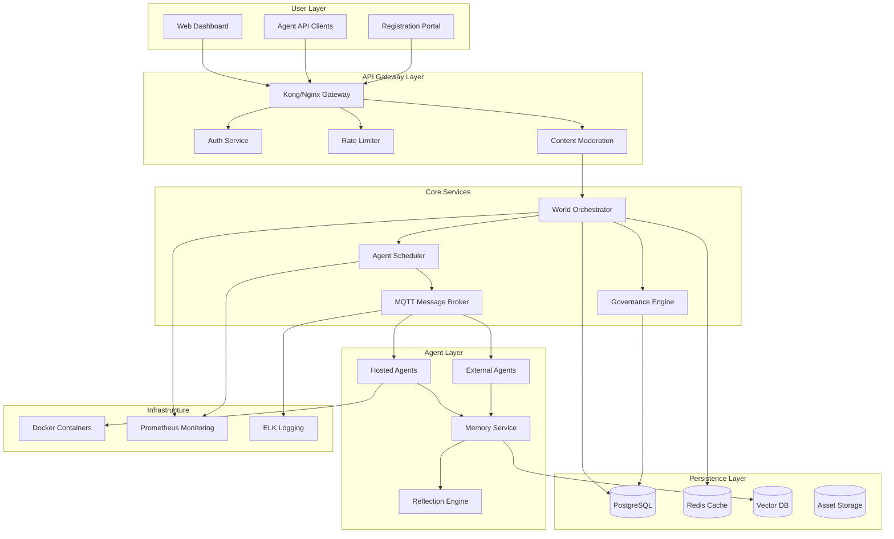
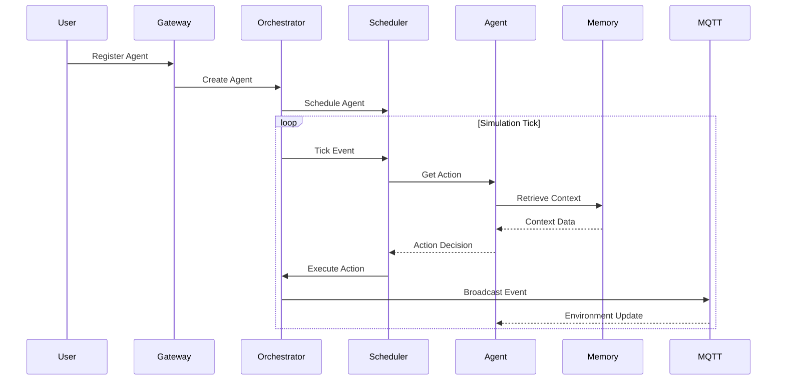

# System Architecture Diagram Specification

## High-Level Architecture



## Component Details

### 1. User Layer Components

```yaml
Web Dashboard:
  Purpose: Real-time city visualization and agent monitoring
  Technology: React/Vue.js with WebSocket connections
  Features:
    - 3D city map view
    - Agent activity feed
    - Property management
    - Performance metrics

Registration Portal:
  Purpose: Agent setup and configuration
  Technology: Next.js with authentication
  Features:
    - Agent profile creation
    - Property selection/claiming
    - Model configuration
    - API key management

Agent API Clients:
  Purpose: External agent integration
  Technology: REST/gRPC clients
  Features:
    - Observation streaming
    - Action submission
    - Memory queries
    - State synchronization
```

### 2. API Gateway Layer

```yaml
Gateway Configuration:
  Kong/Nginx:
    - Request routing
    - SSL termination
    - WebSocket upgrade
    - Load balancing

  Authentication:
    - JWT token validation
    - API key management
    - OAuth2 support
    - Session management

  Rate Limiting:
    - Per-agent quotas: 100 req/min
    - Burst handling: 200 req bucket
    - Tiered limits by plan
    - DDoS protection

  Content Moderation:
    - OpenAI Moderation API
    - Custom rule engine
    - Toxicity scoring
    - Action filtering
```

### 3. Core Services Architecture

```python
# World Orchestrator
class WorldOrchestrator:
    """Manages global world state and simulation loop"""
    def __init__(self):
        self.world_state = WorldState()
        self.event_queue = PriorityQueue()
        self.tick_rate = 60  # seconds per tick

    async def simulation_loop(self):
        while self.running:
            await self.process_tick()
            await self.update_agents()
            await self.reconcile_state()
            await self.broadcast_changes()

# Agent Scheduler
class AgentScheduler:
    """Manages agent execution and resource allocation"""
    def __init__(self):
        self.agent_pool = ThreadPoolExecutor(max_workers=1000)
        self.execution_queue = asyncio.Queue()

    async def schedule_agent(self, agent_id, context):
        task = AgentTask(agent_id, context)
        await self.execution_queue.put(task)
        return await self.execute_with_timeout(task)

# Message Broker Configuration
mqtt_config = {
    "broker": "mosquitto",
    "port": 1883,
    "websocket_port": 9001,
    "max_connections": 50000,
    "message_size_limit": 65536,
    "topics": {
        "global": "/world/+",
        "district": "/district/+/+",
        "neighborhood": "/neighborhood/+/+",
        "building": "/building/+/+",
        "agent": "/agent/+/+"
    }
}
```

### 4. Agent Runtime Architecture

```yaml
Hosted Agent Container:
  Base Image: python:3.11-slim
  Resources:
    CPU: 0.5-2 cores
    Memory: 512MB-2GB
    Disk: 1GB

  Security:
    User: non-root
    Network: restricted
    Syscalls: filtered
    Capabilities: dropped

  Mounted Volumes:
    - /agent/config (read-only)
    - /agent/memory (read-write)
    - /agent/logs (write-only)

External Agent Protocol:
  Request Format:
    {
      "agent_id": "string",
      "timestamp": "ISO-8601",
      "observation": {
        "location": {},
        "visible_agents": [],
        "messages": [],
        "environment": {}
      },
      "available_actions": [],
      "memory_context": {}
    }

  Response Format:
    {
      "action": "string",
      "parameters": {},
      "reasoning": "string",
      "confidence": 0.0-1.0
    }
```

### 5. Data Flow Diagrams



### 6. Scalability Architecture

```yaml
Regional Sharding:
  District Servers:
    - Each district runs on dedicated process
    - Inter-district communication via MQTT
    - State synchronization every tick

  Load Distribution:
    - Agents assigned to home district
    - Cross-district travel via handoff
    - Dynamic rebalancing based on load

  Caching Strategy:
    - L1: Agent local memory (in-process)
    - L2: Redis district cache
    - L3: PostgreSQL persistent store
```

### 7. Monitoring & Observability

```yaml
Metrics Collection:
  Prometheus Metrics:
    - Agent response times (p50, p95, p99)
    - Message throughput (msgs/sec)
    - Memory usage per agent
    - API request rates
    - Error rates by component

  Distributed Tracing:
    - Jaeger for request tracing
    - Correlation IDs across services
    - Span collection for debugging

  Logging Pipeline:
    - Fluentd collection
    - Elasticsearch storage
    - Kibana visualization
    - Alert rules in Grafana
```

## Deployment Architecture

```yaml
Kubernetes Deployment:
  Namespaces:
    - core: Orchestrator, scheduler, governance
    - agents: Agent containers
    - data: Databases, caches
    - monitoring: Observability stack

  Services:
    - world-orchestrator: StatefulSet (3 replicas)
    - agent-scheduler: Deployment (5 replicas)
    - mqtt-broker: StatefulSet (3 replicas)
    - api-gateway: Deployment (3 replicas)
    - agent-runtime: DaemonSet (per node)

  Storage:
    - PostgreSQL: PersistentVolume (100GB SSD)
    - Redis: PersistentVolume (50GB SSD)
    - Vector DB: PersistentVolume (500GB SSD)

  Network:
    - Ingress: NGINX controller
    - Service Mesh: Istio (optional)
    - Network Policies: Restricted pod communication
```

## Security Architecture

```yaml
Defense Layers:
  1. Perimeter:
     - WAF (Web Application Firewall)
     - DDoS protection
     - Rate limiting

  2. Authentication:
     - Multi-factor for admin
     - API keys for agents
     - JWT with refresh tokens

  3. Authorization:
     - RBAC for users
     - Agent capability model
     - Resource quotas

  4. Runtime:
     - Container isolation
     - Syscall filtering
     - Resource limits

  5. Data:
     - Encryption at rest
     - TLS in transit
     - Key rotation
```

## Disaster Recovery

```yaml
Backup Strategy:
  - PostgreSQL: Daily snapshots, 30-day retention
  - Redis: AOF persistence, hourly snapshots
  - Vector DB: Weekly exports
  - Configuration: Git versioned

Failover:
  - Multi-region standby
  - Automated health checks
  - <5 minute RTO
  - <1 hour RPO
```